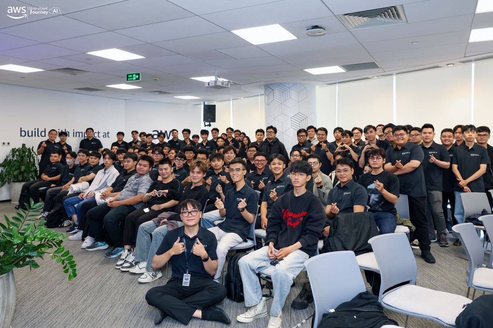
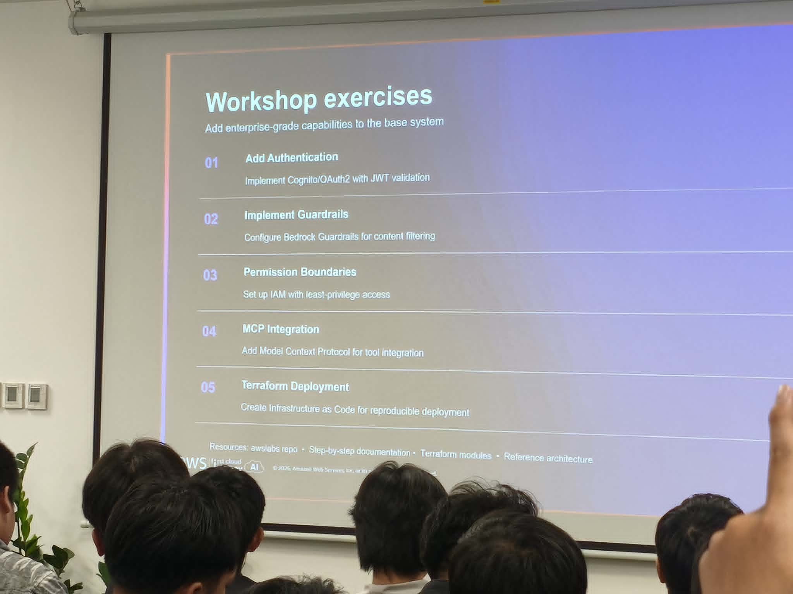
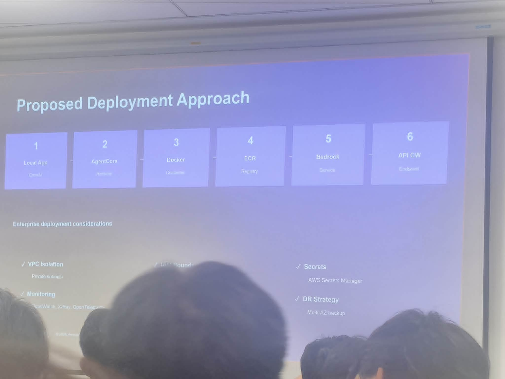
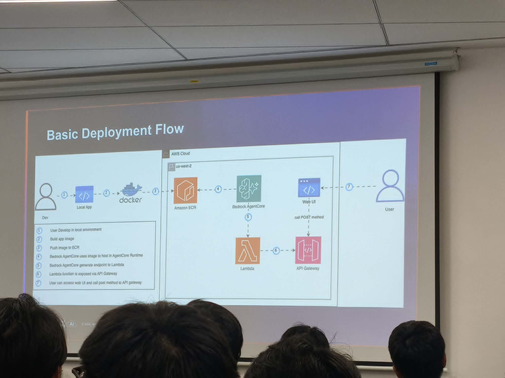
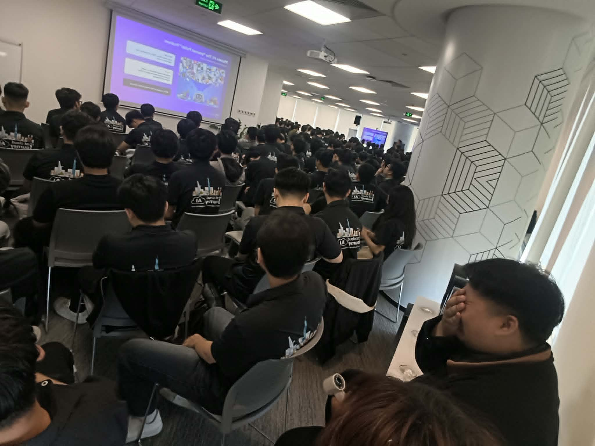

# Reflection Report: “AWS First Cloud AI Journey — Community Day”

### Event Objectives
- Analyze practical challenges in operating Generative AI on large-scale systems.
- Share strategies for optimizing DevOps processes and Platform Engineering.
- Guide the architectural design of systems to handle traffic spikes and manage financial risks in the AWS cloud environment.

### List of Speakers
- **Tinh Truong** - Platform Engineer, GoTymeX
- **Pham Nguyen Hai Anh** - Cloud Consultant, G-AsiaPacific Vietnam & AWS Community Builder
- **Nguyen Tuan Thinh** - DevOps Engineer, First Cloud AI Journey
- **Team VIB** - Representatives of the GenAI and Software Development Engineering Team
- **Duc Dao** - Solution Architect, Cloud Kinetics
- **Vy Lam** - Senior Business Systems Analyst, VPBank

### Key Highlights

#### The Importance of Context (Context Is Everything)
- **AI fails without context**: AI does not need junk data; it requires tightly framed inputs (Goal, Situation, Constraints, Evidence).
- **Avoid the "Internet Puller" trap**: Stuffing large volumes of documents only increases token costs and dilutes important information.
- **Second AI Brain**: Building a memory system that helps AI automatically extract the right pieces of information instead of asking from scratch.

#### Automated System Auditing (GenAI-Powered Auto Audit)
- Utilizing **Amazon Q Business** to connect over 40 internal data portals.
- Automating repetitive tasks: listening to recordings, generating Minutes of Meeting (MoM), and scheduling.
- Applying LLMs to proactively scan AWS infrastructure and cross-reference with information security standards to detect vulnerabilities.

#### Delivery Platform Governance and Cost Risks (CloudFront)
- Leveraging resource delivery power from the Edge-to-Origin network.
- **The Pay-As-You-Go Paradox**: Traffic spikes due to user surges (viral) or DDoS attacks can turn CDN bills into a financial disaster.
- Mandatory setup of **CloudWatch Billing Alerts** for cost warnings and using **AWS WAF** at the edge to protect origin servers.

#### 36-Hour Hackathon Strategy (Building UTMorpho)
- Planning the core architecture and API schema from the beginning so that frontend and backend can run independently and in parallel.
- Accepting trade-offs and intentionally managing technical debt to launch the Minimum Viable Product (MVP) on time.
- Focusing on core features instead of greedily taking on too many details.

#### The Unpredictable Nature of LLMs (Non-Determinism)
- Setting **Temperature = 0** in practice does not guarantee absolutely fixed results.
- Root cause: Extremely small floating-point errors during calculations on thousands of parallel processing GPU cores and the fluctuation of API system load.
- Solution: Write strict system prompts and enforce JSON schema validation to filter results at the backend.

#### Enterprise-Grade Multi-Agent System
- Overcoming the flaws of a Single-Agent (context overflow, hallucinations, "single point of failure").
- Proposing an "AI Committee" model comprising multiple deeply specialized agents (e.g., risk analysis, tech audit, cash flow) coordinated under a central orchestrator layer.
- Protecting LLM workloads through a 5-layer security architecture (Perimeter, VPC, Identity, Application, Data).

### What I Learned

#### Design Thinking
- **Context Minimization**: Providing the minimum amount of data and just enough configuration to solve the right problem instead of throwing a chaotic dataset at the model.
- **Divide and Conquer (Multi-Agent)**: Decomposing AI logic into independent experts, similar to Clean Architecture principles, allowing for easy localized interventions without affecting adjacent systems.

#### Technical Architecture
- The physical nature of GPU computation explains the phenomenon of AI output drift. The lesson learned is never to guess or blindly trust the results generated by LLMs.
- Cloud infrastructure governance is not just about making "code run," but establishing proactive survival limits so the system can protect itself against financial risks.

#### Modernization & Security Strategy
- **Application-layer Defense**: Strictly validate output formats and always build an exception handling parser (fallback) for AI responses.
- Protect static content delivery systems right from the edge using CloudFront OAC.

### Application to Work
- **AI Architecture Optimization**: Applying the Multi-Agent decoupling mindset to build independent processing flows (e.g., a dedicated flow for content generation and another for automated evaluation).
- **Exception Handling**: Adding a robust parser (using regular expressions like `extractJsonObject()`) to proactively handle skewed JSON formats from the API.
- **Infrastructure Security**: Implementing Origin Access Control (OAC) configurations to protect storage resources and setting up strict budget alarms.
- **Defensive Programming**: Translating every task into clear verification criteria; always writing reproducible tests before deploying AI-integrated applications to the production environment.

### Event Experience

Attending the **AWS First Cloud AI Journey — Community Day** was an extremely valuable practical experience, helping me deeply understand the difference between basic API calls and operating a fully architected AI system. Some standout experiences:

#### Learning from Highly Skilled Speakers
- Engineers and experts from VPBank, VIB, and GoTymeX dissected technical blindspots that are often unmentioned in official documentation.
- Absorbed the enterprise systems perspective when evaluating technological risks and optimizing operational costs.

#### Practical Technical Experience
- Understood the mathematical nature behind the unpredictability of LLMs, thereby completely shifting my mindset from passively relying on the `Temperature = 0` parameter.
- Grasped the design patterns and communication flows between components in a distributed Multi-Agent architecture.

#### Applying Modern Tools
- Discovered the immense potential of **Amazon Q Business** in connecting multi-data portals and freeing human effort from tedious information synthesis tasks.
- Updated on modern defense toolkits like AWS WAF integrated into the content delivery ecosystem.

#### Networking and Exchange
- Had the opportunity to discuss directly with cloud architects and veteran mentors.
- Engaged in deep conversations about database design alternatives and bill shock prevention strategies for independent projects.

#### Key Takeaways
- Junk data produces junk results. Providing accurate **Context** turns a vague desire into a measurable and solvable technical problem.
- Building defense mechanisms (from validating model outputs to setting infrastructure spending limits) is a vital prerequisite before putting any AI feature into operation.

#### Event Photos

> Overall, the event not only provided advanced architectural patterns but also reshaped my programming methodology: always be cautious, prioritize simplicity, and translate all potential risks into clear verification tests before writing code.