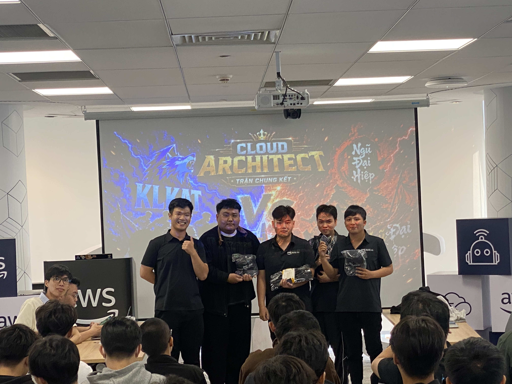
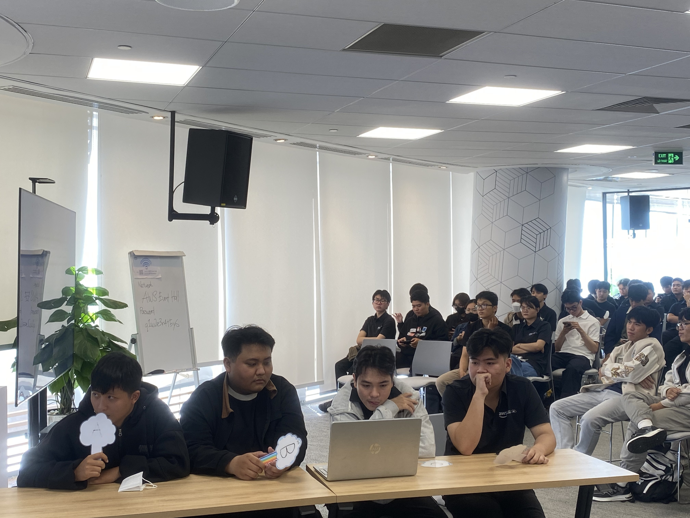

# Bài thu hoạch “Event 7: Cloud Architect - Trận Chung Kết & Chức Vô Địch”

### Mục Đích Của Sự Kiện

- Vượt qua trận chung kết đối kháng kịch tính để kiểm chứng toàn diện kiến thức thiết kế hệ thống trên AWS dưới áp lực thời gian cực lớn.
- Rèn luyện kỹ năng phân tích và đưa ra quyết định kiến trúc đối với các bài toán doanh nghiệp phức tạp (Doanh nghiệp lớn, tính sẵn sàng cao, chịu lỗi tốt).
- Tối ưu hóa kỹ năng hợp tác nhóm, giao tiếp chiến lược và phân bổ vai trò trong các tình huống tranh chấp điểm số trực tiếp.

### Ban Tổ Chức & Thành Phần Tham Dự

- **Ban Tổ Chức**: AWS Study Group
- **Đối thủ chung kết**: Đội thi xuất sắc vượt qua nhánh đấu đối diện (đối thủ mạnh nhất giải đấu)
- **Vai trò**: Thí sinh trực tiếp thi đấu trong đội hình chính thức
- **Kết quả chung cuộc**: **Đội vô địch giải đấu (Championship)**

### Nội Dung Nổi Bật

#### Thể thức thi đấu Chung kết (The Grand Finale)
- Trận đấu diễn ra với 15 câu hỏi tình huống nâng cao, tập trung hoàn toàn vào các kiến trúc thực tế của doanh nghiệp quy mô lớn (Enterprise Grade).
- Điểm số mỗi câu hỏi tăng dần, đòi hỏi sự tập trung tối đa vì chỉ một sơ suất nhỏ cũng có thể khiến đội bạn vươn lên dẫn trước.
- Áp dụng chiến thuật sử dụng thẻ kỹ năng (*Ngôi sao hy vọng* và *Rủi ro tối thiểu*) ở mức độ cân não cao nhất khi điểm số của hai đội bám đuổi sát nút.

#### Trọng tâm chuyên môn: Advanced Cloud Architecting
- Các câu hỏi xoay quanh các bài toán tối ưu hóa chi phí quy mô lớn, thiết kế khả năng chịu lỗi (Fault Tolerance), hệ thống phân tán Multi-Region và chiến lược khắc phục thảm họa (Disaster Recovery - RTO/RPO).
- So sánh sâu các dịch vụ chuyên sâu của AWS như:
  - Aurora Global Database so với DynamoDB Global Tables cho bài toán đồng bộ dữ liệu đa vùng.
  - AWS Direct Connect so với AWS Site-to-Site VPN cho kết nối Hybrid Cloud bảo mật cao.
  - Lựa chọn giải pháp phân tích dữ liệu thời gian thực giữa Amazon Kinesis Data Analytics và Managed Service for Apache Flink.

#### Khoảnh khắc quyết định chức Vô địch
- Trận đấu bám đuổi điểm số kịch tính đến câu hỏi cuối cùng. Nhờ sự phân tích logic chặt chẽ của cả nhóm về cơ chế định tuyến Route 53 (Latency-based vs Geoproximity routing) trong một tình huống phân phối ứng dụng đa quốc gia, đội chúng tôi đã giành điểm số quyết định và chính thức bước lên ngôi vị cao nhất.

### Những Gì Học Được

#### Tư Duy Thiết Kế Hệ Thống Cấp Enterprise
- **Thiết kế hướng đến sự thất bại (Design for Failure)**: Trận chung kết đã củng cố sâu sắc nguyên lý: mọi thành phần hệ thống đều có thể gặp sự cố. Việc thiết kế không chỉ là chọn dịch vụ chạy được, mà phải là thiết kế cơ chế tự động phục hồi (Self-healing), dự phòng nóng (Active-Active) và giảm thiểu ảnh hưởng khi có lỗi xảy ra.
- **Sự đánh đổi về chi phí và hiệu năng (Cost-Performance Trade-offs)**: Học cách cân đo giữa chi phí đầu tư hạ tầng đa vùng (Multi-Region) với mức độ thiệt hại kinh doanh để chọn lựa chiến lược khôi phục phù hợp (Pilot Light, Warm Standby hay Multi-Site).

#### Kiến Thức Kỹ Thuật Chuyên Sâu
- Hiểu rõ cơ chế đồng bộ dữ liệu và giải quyết xung đột ghi/đọc của các dịch vụ lưu trữ dữ liệu phân tán trên AWS.
- Nắm vững các mô hình mạng lai (Hybrid Networking) phức tạp và cách cấu hình bảo mật đa tầng từ Edge (CloudFront, WAF) tới mạng nội bộ (VPC Subnets, Security Groups, NACLs).

#### Giao Tiếp Và Lãnh Đạo Dưới Áp Lực (Pressure Management)
- Trong trận chung kết, thời gian thảo luận bị rút ngắn tối đa. Nhóm đã học được cách lắng nghe chọn lọc, tôn trọng chuyên môn của từng thành viên và ra quyết định nhanh chóng dựa trên dữ liệu thực tế thay vì cảm tính.

### Ứng Dụng Vào Công Việc & Dự Án LingoRise

- **Nâng cấp kiến trúc độ sẵn sàng cao**: Ứng dụng mô hình Multi-AZ cho cơ sở dữ liệu RDS PostgreSQL và cấu hình auto-scaling linh hoạt cho Lambda/API Gateway nhằm đảm bảo LingoRise hoạt động ổn định trong các kỳ thi thử có lượng truy cập đột biến.
- **Tối ưu hóa bảo mật và phân phối**: Thiết lập AWS WAF phía trước CloudFront để ngăn chặn các cuộc tấn công DDoS hoặc quét lỗ hổng tự động, bảo vệ an toàn cho hệ thống dữ liệu câu hỏi và thông tin học viên.

### Trải nghiệm cá nhân trong trận Chung kết

Được đứng trên sân khấu trận chung kết và giành chức vô địch là một trong những trải nghiệm tự hào và đáng nhớ nhất trong hành trình thực tập tại First Cloud Journey. Cảm giác áp lực từ khán giả xung quanh và sự nhạy bén của đội bạn đã tạo nên một bầu không khí thi đấu vô cùng nghẹt thở.

#### Tinh thần đồng đội và sự bứt phá
Chiến thắng này là kết quả của sự phối hợp hoàn hảo. Chúng tôi không có ai là "ngôi sao độc diễn", mỗi người đảm nhận một thế mạnh: người rà soát bẫy đề bài, người phân tích về Network, người phụ trách Database. Khoảnh khắc đội bạn kích hoạt thẻ nhân đôi điểm và dẫn trước đã đẩy chúng tôi vào thế buộc phải bứt phá. Sự bình tĩnh thảo luận trong 30 giây cuối cùng của câu hỏi số 14 về chính sách phân phối CloudFront cache đã giúp chúng tôi lật ngược tình thế.

#### Ý nghĩa của danh hiệu Vô địch
Chức vô địch không chỉ là một chiếc cúp hay phần thưởng, mà đó là sự thừa nhận cho những nỗ lực học hỏi nghiêm túc, những đêm nghiên cứu tài liệu AWS đến sáng của cả nhóm trong suốt kỳ thực tập. Nó chứng minh rằng tư duy phân tích hệ thống logic và tinh thần làm việc nhóm kỷ luật là chìa khóa để giải quyết mọi bài toán công nghệ phức tạp nhất.

#### Một số hình ảnh đáng nhớ tại trận Chung kết

> Chức vô địch Cloud Architect Game Show là một cột mốc rực rỡ, khép lại chuỗi sự kiện thực tập với sự tự tin tuyệt đối vào năng lực thiết kế hệ thống và giải quyết vấn đề thực tế trên nền tảng AWS.
